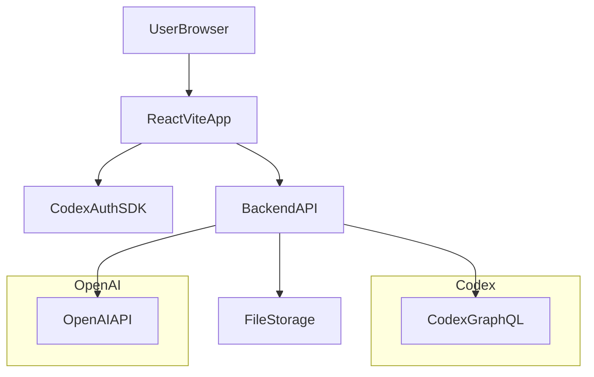

## High-Level Objectives

- **Purpose**: Build a web app that helps semi-professional actors prepare audition sides, rehearse with an AI scene partner (voice), and receive targeted feedback on weak spots.
- **Key features**:
  - Minimal, classic serif design with soft shadows, rounded corners, and smooth, Duolingo-like micro-interactions.
  - Landing page → login/signup → dashboard.
  - Create “Audition preparations” from uploaded PDFs, choose a character, and practice lines with a GPT voice partner.
  - "Audition state" summary showing what’s left to make the text "yours" (gaps, error patterns).
  - Mobile-first layout and PWA support for installable, offline-friendly usage.

## Tech Stack & Services

- **Frontend**:
  - **React + Vite + TypeScript** for SPA structure and fast dev experience.
  - **Tailwind CSS** for utility-first styling and responsive, mobile-first design.
  - **React Router** (or similar) for client-side routing of all pages.
- **Backend / BaaS**:
  - **Codex** for:
    - Authentication (email/password, possibly magic links later).
    - Database (GraphQL API at `https://graph.codex.io/graphql`).
    - Short-lived API tokens for secure frontend access (created server-side).
  - **Lightweight backend** (Node/Express or serverless functions) to:
    - Handle secure Codex API key usage and issue short-lived Codex tokens.
    - Proxy calls to OpenAI (hide OpenAI API key from client).
    - Process PDF uploads (text extraction) and store structured data in Codex.
- **AI & Voice**:
  - **OpenAI** for:
    - Text understanding of uploaded scripts.
    - Generating AI scene partner lines and guidance.
    - Text-to-speech voice output (and optionally speech-to-text for user performance analysis).
  - Prefer OpenAI’s modern **realtime / audio APIs** for interactive voice practice.
- **PWA & Deployment**:
  - **Vite PWA plugin** (`vite-plugin-pwa`) for manifest and service worker.
  - Deployment to a static hosting provider + serverless backend (e.g. Vercel/Netlify/Fly); backend functions live in the same repo.

## Core User Flows

- **Landing → Auth**:
  - User visits landing page, reads value prop, and clicks “Start preparing” or similar CTA.
  - Redirect to login/signup page.
- **Signup / Login**:
  - User creates an account or logs in via Codex auth (email + password initially).
  - On success, user is redirected to the dashboard.
- **Dashboard**:
  - User sees list of existing audition preparations (cards) and a primary CTA to create a new one.
  - Can resume practice for an existing preparation or view its latest audition state.
- **Create Audition Preparation**:
  - User names the preparation.
  - Uploads a PDF containing sides/script.
  - The system extracts text, identifies characters, and the user selects their character.
  - App saves a structured representation of the script to Codex and navigates to practice setup.
- **Practice Audition**:
  - Shows current scene context, user’s lines vs partner lines.
  - AI (GPT voice) plays the other character’s lines.
  - User responds with their lines (spoken), the app captures timing, errors, and repetitions.
  - Progress indicators (e.g. streaks, accuracy % per segment) update live.
- **Audition State**:
  - After a practice block, user can open “Audition state” to see:
    - Bullet points of lines or sections where they consistently stumble.
    - Patterns (e.g. missed words, pacing issues, specific emotional beats not hit).
    - Suggestions on targeted drills or replays.

## Data Model (Codex)

Design entities and relationships for Codex’s GraphQL schema.

- **User**
  - `id`
  - `email`
  - `name`
  - `createdAt`
- **AuditionPreparation**
  - `id`
  - `userId` (FK → User)
  - `title` (name of preparation)
  - `scriptSource` (enum: PDF_UPLOAD, MANUAL_TEXT)
  - `pdfFileUrl` (storage location if needed)
  - `selectedCharacter` (string name)
  - `createdAt`, `updatedAt`
- **ScriptSegment** (line or beat of script)
  - `id`
  - `preparationId` (FK → AuditionPreparation)
  - `characterName`
  - `text`
  - `orderIndex` (for sorting in scene)
  - `sceneLabel` (optional, for grouping)
- **PracticeSession**
  - `id`
  - `preparationId`
  - `startedAt`, `endedAt`
  - `mode` (e.g. FULL_SCENE, LINES_ONLY, DRILL_WEAK_SPOTS)
- **LineAttempt** (per attempt of a particular ScriptSegment by the user)
  - `id`
  - `practiceSessionId`
  - `scriptSegmentId`
  - `attemptNumber`
  - `transcribedText` (user’s spoken line)
  - `accuracyScore` (0–1 based on comparison to script)
  - `timingOffsetMs` (too fast/slow vs expected)
  - `errorTags` (array of enums: MISSING_WORD, EXTRA_WORD, PARAPHRASE, EMOTION_MISMATCH, PAUSE_FILLER, etc.)
- **AuditionStateSummary** (denormalized summary per preparation and optionally per session)
  - `id`
  - `preparationId`
  - `practiceSessionId` (nullable – could be latest aggregate)
  - `generatedAt`
  - `bullets` (array of short text suggestions)
  - `weakSegmentIds` (array of ScriptSegment IDs)
  - `patternSummary` (JSON blob with counts per error type, etc.)

## System Architecture

High-level architecture between frontend, backend, Codex, and OpenAI.

- **Frontend**:
  - Handles routing, UI, and in-browser audio playback/capture.
  - Obtains Codex short-lived tokens via backend to query Codex directly for some operations, or goes through backend as needed.
- **Backend API**:
  - Exposes REST or GraphQL endpoints for:
    - Auth token exchange (Codex).
    - PDF upload + parsing and script segmentation.
    - Practice session management and OpenAI interactions.
    - Generating audition state summaries.
- **Codex**:
  - Stores users, preparations, script segments, sessions, attempts, and summaries.
- **OpenAI**:
  - Provides script understanding, voice generation, and optional speech-to-text.

## Routing & Page Structure

Organize routes using React Router with clear separation of public vs authenticated areas.

- **Routes** (example):
  - `/` → Landing page.
  - `/auth` → Login/Signup (tabs or toggles).
  - `/app` → Authenticated app shell.
    - `/app/dashboard` → Dashboard.
    - `/app/auditions/new` → New audition creation.
    - `/app/auditions/:id/practice` → Practice audition.
    - `/app/auditions/:id/state` → Audition state.
- **File structure** (example):
  - `[src/main.tsx](src/main.tsx)` – app bootstrap.
  - `[src/router.tsx](src/router.tsx)` – route config.
  - `[src/pages/LandingPage.tsx](src/pages/LandingPage.tsx)`
  - `[src/pages/AuthPage.tsx](src/pages/AuthPage.tsx)`
  - `[src/pages/DashboardPage.tsx](src/pages/DashboardPage.tsx)`
  - `[src/pages/NewAuditionPage.tsx](src/pages/NewAuditionPage.tsx)`
  - `[src/pages/PracticePage.tsx](src/pages/PracticePage.tsx)`
  - `[src/pages/AuditionStatePage.tsx](src/pages/AuditionStatePage.tsx)`
  - `[src/components](/src/components)` – shared UI (buttons, cards, navigation, progress indicators, audio controls, etc.).
  - `[src/services/codex.ts](src/services/codex.ts)` – Codex client helpers.
  - `[src/services/openai.ts](src/services/openai.ts)` – OpenAI client helpers.
  - `[src/store](/src/store)` – global app state (if using Zustand/Redux) for auth and current preparation.

## UI & Interaction Design by Page

### Landing Page (`/`)

- **Goal**: Quickly communicate the value and lead users into signup.
- **Layout**:
  - Top nav with logo/wordmark and subtle “Log in” and primary “Get started” button.
  - Hero section with:
    - Large serif headline (e.g. “Make every line yours”).
    - Subheadline in sans-serif for readability.
    - Primary CTA button linking to `/auth`.
  - A simple visual (illustration or abstract shapes) hinting at scripts, audio waves, or stage lights.
  - Brief sections highlighting:
    - Practice with AI scene partner.
    - Targeted feedback on your weak spots.
    - Mobile-first, PWA install.
- **Style**:
  - Light background, serif headings, subtle gradients.
  - Soft shadows and rounded card corners.
  - Micro-interactions: button hover with scale/brightness and a gentle transition.

### Auth Page (`/auth`)

- **Features**:
  - Tabbed or toggle UI for Login vs Signup.
  - Email + password form; optional name field during signup.
  - Form validation and error messaging.
- **Codex integration**:
  - On signup: call backend endpoint that wraps Codex auth create user.
  - On login: call backend for Codex token; store auth state (user, tokens) in front-end store.
  - Use Codex’s short-lived tokens for frontend queries or maintain sessions via HTTP-only cookies from backend.
- **UX details**:
  - Minimal layout with a card centered vertically.
  - Loading state on submission; inline error messages.

### Dashboard Page (`/app/dashboard`)

- **Features**:
  - Header: greeting with user’s name.
  - Primary CTA card: “New audition preparation”.
  - Grid/list of existing preparations:
    - Title, last practiced date, quick stats (e.g. “Lines mastered: 70%”).
    - Actions: “Practice”, “View state”.
  - Simple filter/sort (e.g. by date or title) if necessary.
- **Duolingo-like interactions**:
  - Soft animations when cards appear.
  - Small progress bars and badges.

### New Audition Creation Page (`/app/auditions/new`)

- **Form fields**:
  - Name of preparation (text input).
  - PDF upload (drag-and-drop area & file select button).
- **Flow**:
  - On file selection, call backend to upload PDF, extract text, and detect character names and scenes.
  - Backend returns structured script segments and a list of characters.
  - Display detected characters in a dropdown; user selects which character they are.
  - Confirm and create the `AuditionPreparation` + `ScriptSegments` in Codex.
  - Redirect user to `/app/auditions/:id/practice` with a small success toast.
- **UX**:
  - Show upload progress and parsing state.
  - Provide fallback message if character detection fails and allow manual character selection.

### Practice Audition Page (`/app/auditions/:id/practice`)

- **Layout**:
  - Top bar: back to dashboard, prep title, access to state page.
  - Main area: split into script view and practice controls.
  - Script view:
    - List of ScriptSegments for current scene.
    - Highlight the current line with a colored left border.
    - Clear distinction between user’s lines vs partner’s lines (color/typography).
  - Practice controls:
    - Start/stop session button.
    - Microphone permission prompt if needed.
    - Visualization of AI partner speech (audio waveform or simple pulsing icon).
    - Simple score/streak indicators.
- **Voice practice logic (frontend)**:
  - On start:
    - Request microphone access.
    - Establish a session with backend (POST `/practice-sessions`), receiving session ID and OpenAI/audio session token.
  - When it’s partner’s turn:
    - Backend uses OpenAI to generate the other character’s line + voice.
    - Frontend receives an audio stream or URL and plays it.
  - When it’s user’s turn:
    - Capture microphone audio.
    - Stream or upload the user’s utterance to backend.
- **Voice practice logic (backend)**:
  - Maintain state per `PracticeSession` (which ScriptSegment is next, whose turn, etc.).
  - For partner lines:
    - Craft prompts for GPT to stay strictly on script for the partner’s lines, with mild flexibility for pacing.
    - Request audio output via OpenAI, return audio to frontend.
  - For user lines:
    - Receive audio blob or stream.
    - Use OpenAI speech-to-text to transcribe.
    - Compare transcription to the ScriptSegment text:
      - Compute similarity and mark errors (missing/extra words, paraphrasing, etc.).
    - Store `LineAttempt` records in Codex.
  - Emit real-time feedback (e.g. via SSE or websockets) to update the UI.

### Audition State Page (`/app/auditions/:id/state`)

- **Goal**: Provide actionable summary of what’s left to master.
- **Data sources**:
  - Last `PracticeSession` and associated `LineAttempts` for the preparation.
  - Aggregated errors per script segment and error type.
- **Backend generation**:
  - Collect all `LineAttempt` records for the relevant session(s).
  - Derive:
    - Lines with low accuracy or many retries.
    - Common error tags (e.g. always missing end of sentence, or rushing long monologues).
  - Feed structured data into GPT with a prompt like:
    - “Summarize this actor’s performance and generate bullet points about what’s left to make the text theirs, focusing on recurring issues.”
  - Store result as an `AuditionStateSummary` entry in Codex.
- **UI**:
  - Title & last updated info.
  - Section: **“What’s left to make the text yours”** – bullet list of friendly, specific suggestions.
  - Section: **Patterns** – a compact visualization (e.g. bar chart or tags) of common error types.
  - Optional: quick links like “Drill these lines” that deep-link back into practice mode focused on weak segments.

## AI Prompting & Evaluation Strategy

- **Script understanding**:
  - After extracting text from PDF, send script (or chunks) to GPT with instructions to:
    - Identify character names.
    - Break dialogue into per-line segments with `characterName`, `text`, `sceneLabel`.
    - Ensure outputs are machine-parseable JSON.
- **Partner behavior**:
  - Keep prompts strict about not improvising lines beyond minor timing/intonation variations.
  - Add instructions for supportive, non-judgmental tone and very brief mid-scene feedback when appropriate.
- **Performance evaluation**:
  - After obtaining transcription of user’s line, first run a deterministic text comparison to compute base accuracy.
  - Optionally use GPT to:
    - Classify error types and emotional delivery quality.
    - Suggest targeted drills based on patterns.
- **Audition state summary**:
  - Supply aggregated stats (per line, per error type) and some raw example attempts to GPT.
  - Ask for 3–7 concise bullet points and avoid generic advice.

## Codex Integration Details

- **Auth & tokens**:
  - Backend stores Codex secret API key securely.
  - When user logs in/signup, backend communicates with Codex Auth endpoints.
  - Use Codex’s `createApiTokens` to issue short-lived tokens for frontend use, limiting scope and lifetime.
- **GraphQL helpers**:
  - In `[src/services/codex.ts](src/services/codex.ts)`, implement:
    - `fetchUserPreparations(userId)`
    - `createPreparationWithSegments(input)`
    - `startPracticeSession(preparationId, userId)`
    - `recordLineAttempt(input)`
    - `saveAuditionStateSummary(input)`
  - Wrap Codex GraphQL fetch calls with proper error handling and retries.
- **Security**:
  - Never expose Codex secret keys in frontend.
  - Only short-lived tokens or backend-proxied calls from the browser.

## PWA, Mobile-First, and Performance

- **Mobile-first**:
  - Design Tailwind breakpoints so default is mobile layout, then scale up.
  - Ensure all primary actions are reachable with thumb on small screens.
  - Use bottom-fixed practice controls on mobile for the Practice page.
- **PWA setup**:
  - Add Vite PWA plugin in `vite.config.ts`.
  - Create `manifest.webmanifest` with name, icons, start URL, and display mode `standalone`.
  - Configure basic caching strategy for static assets.
  - Be cautious with caching dynamic API responses to avoid stale practice data.
- **Performance**:
  - Lazy-load heavier routes (e.g. practice page) using code splitting.
  - Debounce network-heavy operations.
  - Stream audio when possible instead of downloading large files.

## Testing & Quality

- **Unit tests**:
  - For script parsing logic (ensuring segments line up correctly).
  - For text comparison & error-tagging functions.
- **Integration tests**:
  - Auth flow with Codex (mock responses).
  - Full practice flow: create preparation → run practice → generate audition state.
- **UX polish**:
  - Micro-animations for transitions (Framer Motion or simple CSS transitions).
  - Clear success/error toasts.
  - Empty states for dashboard and audition state page.

## Implementation Phases

1. **Project Setup**
  - Initialize Vite + React + TS + Tailwind.
  - Configure routing, base layout, and theme (serif headings, soft shadows).
  - Add Vite PWA plugin skeleton.
2. **Auth & Codex Integration**
  - Implement backend auth endpoints wrapping Codex.
  - Build frontend auth context and protected routes.
  - Implement `/auth` UI and connect to backend.
3. **Core Pages (Non-AI)**
  - Landing page UI and navigation.
  - Dashboard layout with dummy data.
  - New audition page UI and basic form wiring.
4. **PDF Upload & Script Parsing**
  - Implement backend PDF upload & text extraction.
  - Integrate GPT-based script segmentation.
  - Persist preparations and segments in Codex.
  - Connect New Audition page to backend.
5. **Practice Engine (Non-Voice)**
  - Implement practice flow only with text (AI as text partner) to validate logic.
  - Implement `PracticeSession` and `LineAttempt` recording.
6. **Add Voice & Realtime Interaction**
  - Integrate OpenAI TTS and STT.
  - Add audio playback and microphone capture on Practice page.
  - Tune prompts and timing for a smooth back-and-forth experience.
7. **Audition State Generation**
  - Implement aggregation logic and GPT summarization.
  - Build Audition State page UI.
  - Add quick links back into practice for weak lines.
8. **PWA Hardening & Mobile Polish**
  - Finalize manifest, icons, and offline behavior.
  - Optimize layouts and interactions on mobile.
9. **Testing, Analytics & Beta Launch**
  - Add tests for critical pieces.
  - Add basic analytics (page views, session start/complete).
  - Deploy to production environment and test on real devices.

